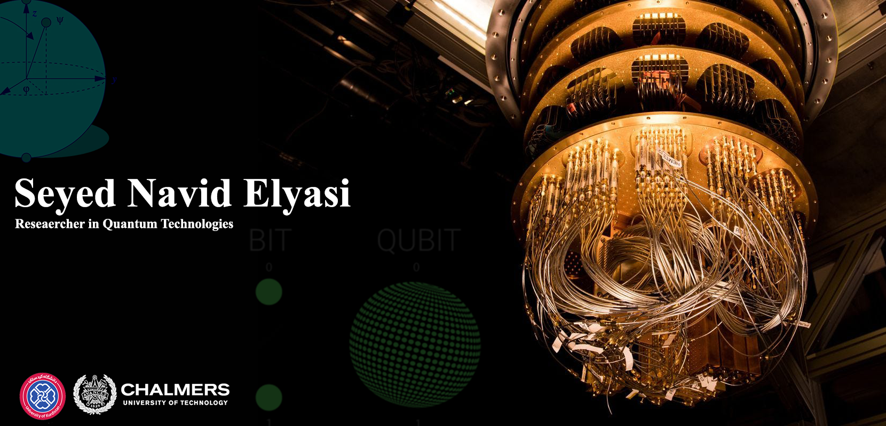

Seyed Navid Elyasi
------------------------------------

I began my coding journey in childhood, programming microcontrollers in C/C++ to create projects like line-following robots. In university, I expanded into Python, using it to tackle complex physics problems. During my MSc, I specialized further, focusing on quantum technologies with Python, working extensively with libraries such as Qiskit, QuTiP, and Strawberry Fields.

* 🌍  I'm based in Sanandaj, Kurdistan, Iran
* ✉️  You can contact me at [n.elyasi@@uok.ac.ir](mailto:n.elyasi@@uok.ac.ir)
* 🚀  I'm currently working on [BatSim - Experimental simulation of daemonic work extraction in open quantum batteries on a digital quantum computer](http://arxiv.org/abs/2410.16567)
* 🧠  I'm learning Machine Learning
* 🤝  I'm open to collaborating on Quantum Technologies Based Proposals

### Skills

### Socials

 <a href="https://www.github.com/nelyasi" target="_blank" rel="noreferrer"> <picture> <source media="(prefers-color-scheme: dark)" srcset="https://raw.githubusercontent.com/danielcranney/readme-generator/main/public/icons/socials/github-dark.svg" /> <source media="(prefers-color-scheme: light)" srcset="https://raw.githubusercontent.com/danielcranney/readme-generator/main/public/icons/socials/github.svg" />  </picture> </a> <a href="https://www.linkedin.com/in/navid-elyasi-49063922b/" target="_blank" rel="noreferrer"> <picture> <source media="(prefers-color-scheme: dark)" srcset="https://raw.githubusercontent.com/danielcranney/readme-generator/main/public/icons/socials/linkedin-dark.svg" /> <source media="(prefers-color-scheme: light)" srcset="https://raw.githubusercontent.com/danielcranney/readme-generator/main/public/icons/socials/linkedin.svg" />  </picture> </a> <a href="https://www.stackoverflow.com/users/29458/physicino" target="_blank" rel="noreferrer"> <picture> <source media="(prefers-color-scheme: dark)" srcset="https://raw.githubusercontent.com/danielcranney/readme-generator/main/public/icons/socials/stackoverflow-dark.svg" /> <source media="(prefers-color-scheme: light)" srcset="https://raw.githubusercontent.com/danielcranney/readme-generator/main/public/icons/socials/stackoverflow.svg" />  </picture> </a> <a href="https://www.x.com/SNavidElyasi" target="_blank" rel="noreferrer"> <picture> <source media="(prefers-color-scheme: dark)" srcset="https://raw.githubusercontent.com/danielcranney/readme-generator/main/public/icons/socials/twitter-dark.svg" /> <source media="(prefers-color-scheme: light)" srcset="https://raw.githubusercontent.com/danielcranney/readme-generator/main/public/icons/socials/twitter.svg" />  </picture> </a>

### Badges

<b>My GitHub Stats</b>

<b>Top Repositories</b>

       
