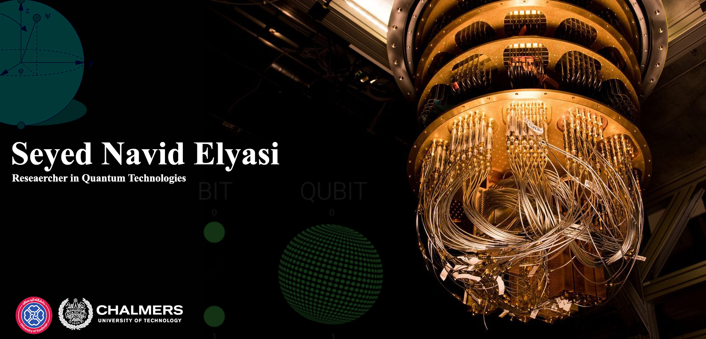

# Seyed Navid Elyasi

I started programming at an early age, working with microcontrollers in C/C++ and building projects such as line-following robots. Over time, my interests evolved toward scientific computing and quantum technologies.

During my university studies, I used Python extensively for computational physics and numerical simulations. This later developed into a specialization in quantum technologies during my MSc, where I worked with frameworks including Qiskit, QuTiP, and Strawberry Fields.

My current research focuses on Quantum Data Centers and Distributed Quantum Computing, with broader interests in quantum systems, high-performance computing, and machine learning.

- 🌍 Based in Gothenburg, Sweden  
- ✉️ Contact: [elyasi@chalmers.se](mailto:elyasi@chalmers.se)  
- 🚀 Researching Quantum Data Centers & Distributed Quantum Computing  
- 🧠 Currently exploring Machine Learning applications in scientific computing  
- 🤝 Open to collaborations and research proposals in Quantum Technologies  

---

## Skills

  

---

## Publications

### 2026

- **Impact of Delay and Measurement Error on Remote Gate Fidelity in Quantum Data Centers**  
  *S. N. Elyasi, R. Lin, P. Monti*  
  Optica Quantum 2.0, Glasgow, 2026

- **Feasibility of Distributed Measurement-Based Quantum Computing in Quantum Data Centers**  
  *S. N. Elyasi, R. Lin, P. Monti*  
  Optica Quantum 2.0, Glasgow, 2026

- **Emulation of Optically Interconnected Quantum Data Center Topologies for Cost–Fidelity Benchmarking**  
  *S. N. Elyasi, S. M. Ahmadian, R. Lin, P. Monti*  
  Optical Fiber Communication Conference (OFC), 2026

### 2025

- **Toward Quantum Data Centers: Noise Evaluation of Fiber-Based Interconnects Through Distributed Algorithm Emulation**  
  *S. N. Elyasi, S. M. Ahmadian, J. Li, P. Monti, R. Lin*  
  European Conference on Optical Communications (ECOC), pp. 1–4, 2025

- **A Framework for Quantum Data Center Emulation Using Digital Quantum Computers**  
  *S. N. Elyasi, P. Monti, J. Li, R. Lin*  
  arXiv:2509.04029, 2025  
  [View Publication](https://arxiv.org/abs/2509.04029)

- **Experimental Simulation of Daemonic Work Extraction in Open Quantum Batteries on a Digital Quantum Computer**  
  *S. N. Elyasi, M. A. C. Rossi, M. G. Genoni*  
  Quantum Science and Technology, 10(2), 025017, 2025

- **Waveguide Evanescent Field Fluorescence Microscopy Images of Osteoblast Cells: The Effect of Trypsin and Image Processing Using TrackMate**  
  *A. Hassanzadeh, S. N. Elyasi, S. Salih, S. S. Abdulkareem, S. R. Saeed*  
  Microscopy Research and Technique, 88(5), 1326–1334, 2025

- **Implementing Direct Three-Tangle Measurement of Tripartite GHZ States on IBM Quantum Platforms**  
  *S. N. Elyasi, M. Yahyavi, N. Karimi*  
  Quantum Information Processing, 24(1), 26, 2025

- **Implementation and Measurement of Quantum Entanglement Using IBM Quantum Platforms**  
  *N. Karimi, S. N. Elyasi, M. Yahyavi*  
  Physica Scripta, 99(4), 045121, 2024

---

## Socials

<a href="https://www.github.com/nelyasi" target="_blank" rel="noreferrer">
<picture>
<source media="(prefers-color-scheme: dark)" srcset="https://raw.githubusercontent.com/danielcranney/readme-generator/main/public/icons/socials/github-dark.svg" />
<source media="(prefers-color-scheme: light)" srcset="https://raw.githubusercontent.com/danielcranney/readme-generator/main/public/icons/socials/github.svg" />

</picture>
</a>

<a href="https://www.linkedin.com/in/navid-elyasi-49063922b/" target="_blank" rel="noreferrer">
<picture>
<source media="(prefers-color-scheme: dark)" srcset="https://raw.githubusercontent.com/danielcranney/readme-generator/main/public/icons/socials/linkedin-dark.svg" />
<source media="(prefers-color-scheme: light)" srcset="https://raw.githubusercontent.com/danielcranney/readme-generator/main/public/icons/socials/linkedin.svg" />

</picture>
</a>

<a href="https://www.stackoverflow.com/users/29458/physicino" target="_blank" rel="noreferrer">
<picture>
<source media="(prefers-color-scheme: dark)" srcset="https://raw.githubusercontent.com/danielcranney/readme-generator/main/public/icons/socials/stackoverflow-dark.svg" />
<source media="(prefers-color-scheme: light)" srcset="https://raw.githubusercontent.com/danielcranney/readme-generator/main/public/icons/socials/stackoverflow.svg" />

</picture>
</a>

<a href="https://www.x.com/SNavidElyasi" target="_blank" rel="noreferrer">
<picture>
<source media="(prefers-color-scheme: dark)" srcset="https://raw.githubusercontent.com/danielcranney/readme-generator/main/public/icons/socials/twitter-dark.svg" />
<source media="(prefers-color-scheme: light)" srcset="https://raw.githubusercontent.com/danielcranney/readme-generator/main/public/icons/socials/twitter.svg" />

</picture>
</a>

---

## GitHub Statistics

  

  

---

## Featured Repository

  

